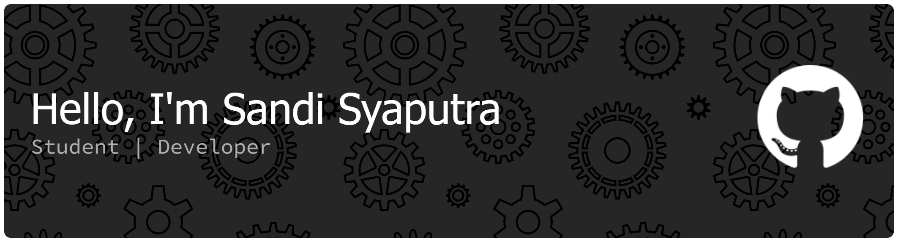

## Hi there, I'm Sandi Syaputra👋

# 💫 About Me:
🔭 I'm currently working on Building small Flutter apps & improving my mobile development workflow 🌱 I'm currently learning Flutter, Dart, and clean architecture for mobile apps 👯 I'm looking to collaborate on Flutter-based projects, especially creative mobile apps or experimental UI projects 📫 How to reach me: https://www.instagram.com/sandisya__?igsh=MWF1YW9scGxmaXN5bQ== ⚡ Fun fact: I love music, play in a band, and often code while listening to my favorite tracks🎸🎧

## 🌐 Socials:
 

# 💻 Tech Stack:
                 
# 📊 GitHub Stats:
 
 

<picture>
  <source media="(prefers-color-scheme: dark)" srcset="https://raw.githubusercontent.com/sandisya/sandisya/output/pacman-contribution-graph-dark.svg">
  <source media="(prefers-color-scheme: light)" srcset="https://raw.githubusercontent.com/sandisya/sandisya/output/pacman-contribution-graph.svg">
  
</picture>

###

###

---

